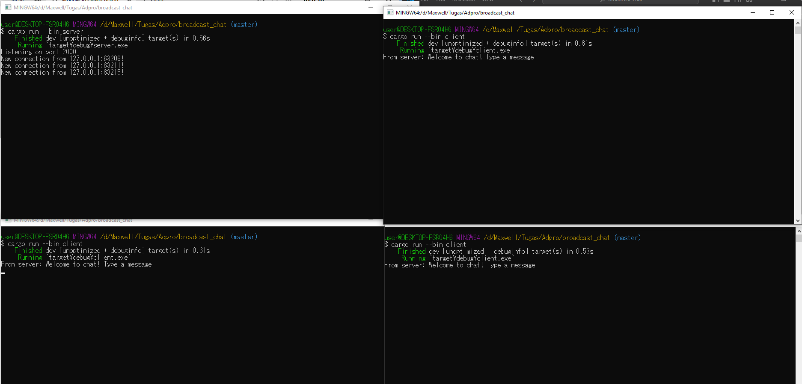
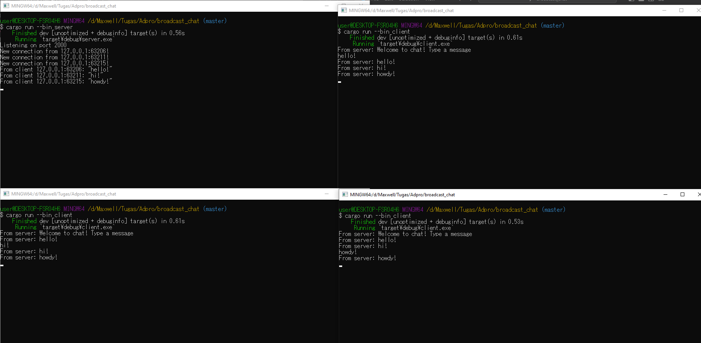

# Module 10 - Broadcast Chat

Pada gambar di atas, dapat dilihat bahwa ketika seorang client mengirimkan sebuah pesan, pesan tersebut akan diterima oleh server kemudian server akan membagikan pesan tersebut ke semua client yang sedang terhubung ke server tersebut, termasuk client yang mengirimkan pesan tersebut. Hal ini terjadi karena setiap client yang menghubungkan diri ke server akan diingat oleh server dan server akan menunggu hingga salah satu client tersebut mengirimkan sebuah pesan ke server untuk server bagikan ke semua client yang terhubung padanya.
