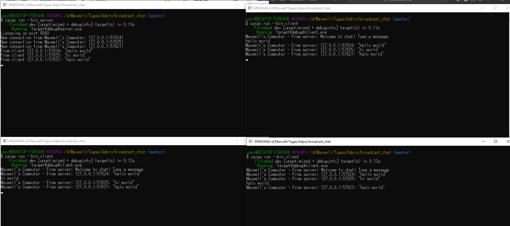

# Module 10 - Broadcast Chat

## 2.1

Pada gambar di atas, dapat dilihat bahwa ketika seorang client mengirimkan sebuah pesan, pesan tersebut akan diterima oleh server kemudian server akan membagikan pesan tersebut ke semua client yang sedang terhubung ke server tersebut, termasuk client yang mengirimkan pesan tersebut. Hal ini terjadi karena setiap client yang menghubungkan diri ke server akan diingat oleh server dan server akan menunggu hingga salah satu client tersebut mengirimkan sebuah pesan ke server untuk server bagikan ke semua client yang terhubung padanya.

## 2.2

Pada gambar di atas, port dari client dan server berbeda, dimana server menunggu koneksi pada port `2000` sedangkan client ingin menghubungi sebuah `websocket` yang sedang berjalan pada port `8080`. Namun, karena tidak ada `websocket` yang sedang berjalan pada port `8080`, client mengalami error `ConnectionRefused`, yang menandakan bahwa client sudah mencoba beberapa kali untuk menghubungi `websocket` pada port `8080` tetapi hubungan tersebut tidak pernah berhasil.

Setelah mengubah port server dari `2000` menjadi `8080`, client dapat berhubungan kembali dengan server seperti sebelumnya. Namun, berbeda dengan client yang menggunakan protokol `websocket` untuk menghubungi server, server hanya mendengarkan koneksi TCP yang terjadi pada port `8080`, dimana koneksi yang terjadi akan dijadikan sebuah stream `websocket` melalui code.

## 2.3

Dapat dilihat dari gambar di atas, setiap broadcast dari server sekarang memiliki informasi mengenai dari client mana pesan itu dikirimkan. Saya dapat melakukan hal ini dengan mengubah bagian code pada `src/bin/server.rs` yang bertujuan mengirimkan pesan ke semua client yang sedang terhubung, tepatnya pada baris `bcast_tx.send(text.into())?;` saya ubah menjadi `bcast_tx.send(format!("{addr:?}: {text:?}"))?;`. Dengan demikian, ketika seorang client mengirimkan pesan, server akan membroadcast pesan tersebut dengan informasi client mana yang mengirimkan pesan tersebut.
